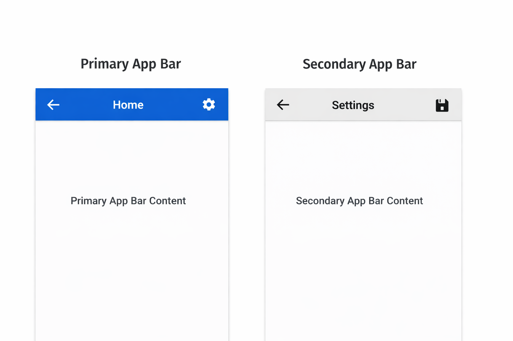

## CustomAppBar Library (Android Kotlin)
[](https://kotlinlang.org/)
[](LICENSE)
[](#)

A clean, lightweight, and fully customizable **Custom AppBar Library** for Android applications.

This library provides two reusable toolbar components:

✅ Primary App Bar  
✅ Secondary App Bar  

Both support:

- Title text  
- Back button  
- Action icon button  
- Custom background color  
- Custom title color  
- Easy XML + Kotlin integration  

---

### Preview



---

### Features

- Ready-to-use AppBar Views  
- No complex setup  
- Works with any Android project  
- Fully customizable using XML attributes  
- Supports back navigation click listener  
- Supports action icon click listener  
- Professional UI structure (publish-ready)

---


## 📦 Components Included

| Component | Description |
|----------|-------------|
| `PrimaryAppBarView` | Main top toolbar (dark style, primary use) |
| `SecondaryAppBarView` | Smaller secondary toolbar (light style) |

---

## Installation (JitPack)

### 1️⃣ Add JitPack to your **root `settings.gradle` or `build.gradle`**

```gradle
dependencyResolutionManagement {
    repositories {
        google()
        mavenCentral()
        maven { url 'https://jitpack.io' }
    }
}
```
### Add Dependency
```
dependencies {
	        implementation 'com.github.Excelsior-Technologies-Community:Android_CustomAppBar:1.0.0'
	}
```

---

### Usage Guide

**Primary App Bar**

XML Usage
```xml
<com.ext.customappbar.components.PrimaryAppBarView
    android:id="@+id/primaryAppBar"
    android:layout_width="match_parent"
    android:layout_height="wrap_content"

    app:title="Home"
    app:showBack="true"
    app:actionIcon="@drawable/ic_settings"
    app:backgroundColor="#0D47A1"
    app:titleColor="@android:color/white"/>
```

Kotlin Usage
```kotlin
val appBar = findViewById<PrimaryAppBarView>(R.id.primaryAppBar)

appBar.setOnBackClick {
    finish()
}

appBar.setOnActionClick {
    Toast.makeText(this, "Action Clicked!", Toast.LENGTH_SHORT).show()
}
```

**Secondary App Bar**

XML Usage
```xml
<com.ext.customappbar.components.SecondaryAppBarView
    android:id="@+id/secondaryAppBar"
    android:layout_width="match_parent"
    android:layout_height="wrap_content"

    app:title="Settings"
    app:showBack="true"
    app:actionIcon="@drawable/ic_save"
    app:backgroundColor="#EEEEEE"
    app:titleColor="#000000"/>
```

Kotlin Usage
```kotlin
val secondaryBar =
    findViewById<SecondaryAppBarView>(R.id.secondaryAppBar)

secondaryBar.setOnBackClick {
    onBackPressed()
}

secondaryBar.setOnActionClick {
    Toast.makeText(this, "Saved!", Toast.LENGTH_SHORT).show()
}
```

---

### Custom XML Attributes

Both AppBars support these attributes:

| Attribute            | Type     | Description              |
|---------------------|----------|--------------------------|
| `app:title`         | String   | Toolbar title text       |
| `app:showBack`      | Boolean  | Show/hide back button    |
| `app:actionIcon`    | Drawable | Action icon on right     |
| `app:backgroundColor` | Color  | Toolbar background color |
| `app:titleColor`    | Color    | Toolbar title text color |

---

---

### License

```
MIT License

Copyright (c) 2025 Excelsior Technologies 

Permission is hereby granted, free of charge, to any person obtaining a copy
of this software and associated documentation files (the "Software"), to deal
in the Software without restriction, including without limitation the rights
to use, copy, modify, merge, publish, distribute, sublicense, and/or sell
copies of the Software, and to permit persons to whom the Software is
furnished to do so, subject to the following conditions:

The above copyright notice and this permission notice shall be included in all
copies or substantial portions of the Software.

THE SOFTWARE IS PROVIDED "AS IS", WITHOUT WARRANTY OF ANY KIND, EXPRESS OR
IMPLIED, INCLUDING BUT NOT LIMITED TO THE WARRANTIES OF MERCHANTABILITY,
FITNESS FOR A PARTICULAR PURPOSE AND NONINFRINGEMENT. IN NO EVENT SHALL THE
AUTHORS OR COPYRIGHT HOLDERS BE LIABLE FOR ANY CLAIM, DAMAGES OR OTHER
LIABILITY, WHETHER IN AN ACTION OF CONTRACT, TORT OR OTHERWISE, ARISING FROM,
OUT OF OR IN CONNECTION WITH THE SOFTWARE OR THE USE OR OTHER DEALINGS IN THE
SOFTWARE.
```
